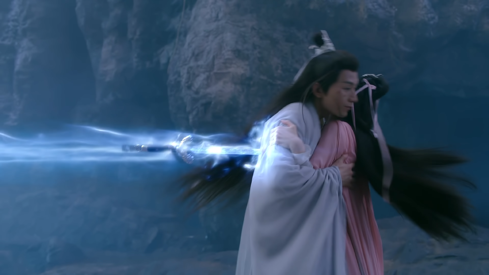

| EP   | 施暴者      | 简介                           | 图片                                                         |
| ---- | ----------- | ------------------------------ | ------------------------------------------------------------ |
| 27   | 璇玑前世(4) | 第四世水牢比武                 |  |
| 27   | 璇玑前世(6) | 第六世璇玑逼问藏宝图           |  |
| 27   | 璇玑前世(7) | 第七世璇玑为夺掌门之位         |  |
| 27   | 蒙面刺客    | 为救第八世璇玑                 |  |
| 27   | 第九世司凤  | 为给第九世璇玑自由，送剑入心   |  |
| 30   | 若玉        | 保护璇玑                       |  |
| 42   | 褚掌门      | 褚掌门为除魔煞星               |  |
| 44   | 昊辰        | 司凤与战神大战被昊辰偷袭       |  |
| 47   | 璇玑        | 璇玑误认司凤为魔煞星并杀害昊辰 |  |
| 59   | 元朗        | 元朗欲杀阻挡鸿蒙熔炉倾覆的司凤 |  |

